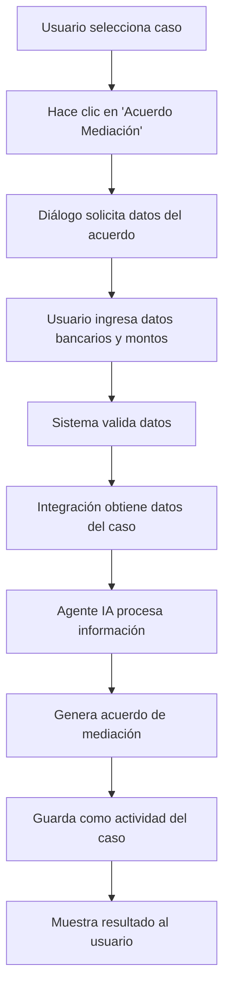

# 🤖 Integración del Agente IA Refactorizado con LPMS

## 📋 Resumen Ejecutivo

Este documento describe la integración completa del **Agente IA Refactorizado** con el sistema **LPMS (Legal Practice Management System)**. La integración permite generar acuerdos de mediación utilizando IA avanzada directamente desde la interfaz del sistema de gestión legal.

## 🏗️ Arquitectura de la Integración

### Componentes Principales

#### 1. **Agente Refactorizado** (`agent_core.py`, `agent_tools.py`)
- **Arquitectura modular** con prompts externos
- **Tres herramientas especializadas** usando StructuredTool
- **Sistema de razonamiento ReAct** para toma de decisiones
- **Validación robusta** con esquemas Pydantic

#### 2. **Módulo de Integración** (`agent_integration.py`)
- **Puente entre sistemas**: Conecta el agente con la base de datos LPMS
- **Acceso a datos del caso**: Cliente, partes, actividades, historial
- **Generación de acuerdos**: Procesa datos y genera documentos legales
- **Guardado automático**: Almacena resultados como actividades del caso

#### 3. **Interfaz de Usuario Integrada** (`main_app.py`)
- **Botón "Acuerdo Mediación"**: Punto de entrada desde el seguimiento del caso
- **Diálogo de datos**: Interfaz intuitiva para ingresar información del acuerdo
- **Procesamiento asíncrono**: No bloquea la interfaz durante la generación
- **Feedback visual**: Indicadores de progreso y resultados

#### 4. **Sistema de Pruebas** (`test_agent_integration.py`)
- **Pruebas independientes**: Verificación sin ejecutar toda la aplicación
- **Múltiples modos**: Automático e interactivo
- **Creación de datos de prueba**: Casos de testing cuando no hay datos reales

## 🔧 Instalación y Configuración

### Requisitos Previos

```bash
# Instalar dependencias del agente
pip install langchain langchain-community pydantic numexpr

# Instalar Ollama (motor LLM)
# Descargar desde: https://ollama.ai/
ollama pull llama2  # o el modelo que prefieras
```

### Configuración

1. **Archivos de Prompts**: Los archivos `persona.txt` y `react_instructions.txt` deben estar en la raíz del proyecto
2. **Base de Datos**: Configurar PostgreSQL según `config.ini`
3. **Modelo LLM**: Configurar Ollama con el modelo deseado

## 🚀 Uso del Sistema

### Desde la Interfaz Gráfica

1. **Seleccionar Caso**: Elegir un caso desde la lista principal
2. **Ir al Seguimiento**: Acceder a la pestaña de seguimiento del caso
3. **Generar Acuerdo**: Hacer clic en el botón "Acuerdo Mediación"
4. **Ingresar Datos**: Completar el formulario con:
   - Monto de compensación
   - Plazo de pago (días)
   - Datos bancarios del actor
   - CUIT del actor
5. **Procesar**: El sistema genera el acuerdo usando IA
6. **Resultado**: El acuerdo se guarda automáticamente como actividad

### Desde Código (API)

```python
from agent_integration import create_mediation_agreement

# Datos del acuerdo
agreement_data = {
    "monto_compensacion": "75000.00",
    "plazo_pago_dias": "30",
    "banco_actor": "Banco de la Nación Argentina",
    "cbu_actor": "0110599520000001234567",
    "alias_actor": "empleado.indemnizacion",
    "cuit_actor": "20-12345678-9"
}

# Generar acuerdo para caso específico
result = create_mediation_agreement(case_id=123, agreement_data=agreement_data)

if result["success"]:
    print("✅ Acuerdo generado:", result["response"])
else:
    print("❌ Error:", result["error"])
```

### Pruebas Independientes

```bash
# Ejecutar pruebas interactivas
python test_agent_integration.py

# Ejecutar pruebas automáticas (para CI/CD)
python test_agent_integration.py --auto
```

## 🛠️ Herramientas Disponibles

### 1. Generar Escrito de Mediación
**Propósito**: Crear documentos legales de acuerdo de mediación

**Parámetros**:
- `id_del_caso`: ID numérico del caso
- `monto_compensacion`: Monto total del acuerdo
- `plazo_pago_dias`: Días para el pago
- `banco_actor`: Nombre del banco
- `cbu_actor`: CBU de 22 dígitos
- `alias_actor`: Alias de la cuenta
- `cuit_actor`: CUIT/CUIL del actor

### 2. Calculadora Matemática
**Propósito**: Realizar cálculos aritméticos precisos

**Parámetros**:
- `expresion`: Expresión matemática válida

**Ejemplos**:
```python
# Desde el agente
calculadora_matematica_tool.run({"expresion": "15000 * 1.21"})
# Resultado: "El resultado del cálculo '15000 * 1.21' es: 18150.0"
```

### 3. Solicitar Nueva Herramienta
**Propósito**: Registrar solicitudes de nuevas funcionalidades

**Parámetros**:
- `descripcion_necesidad`: Descripción detallada de la funcionalidad requerida

## 📊 Flujo de Trabajo



## 🔍 Monitoreo y Debugging

### Logs del Sistema

Los logs se generan en múltiples niveles:

1. **Agente Core**: Logs de inicialización y procesamiento
2. **Herramientas**: Logs de ejecución de cada tool
3. **Integración**: Logs de conexión con base de datos
4. **Aplicación**: Logs de la interfaz gráfica

### Estadísticas de Rendimiento

```python
from agent_tools import get_agent_tools_performance_stats

stats = get_agent_tools_performance_stats()
print(f"Total llamadas: {stats['total_calls']}")
print(f"Tasa de éxito: {stats['success_rate']}%")
print(f"Duración promedio: {stats['average_duration']:.3f}s")
```

## 🐛 Solución de Problemas

### Problemas Comunes

#### 1. Error de Importación de numexpr
```bash
pip install numexpr
# O usar el fallback automático que utiliza eval()
```

#### 2. Error de Conexión a Base de Datos
- Verificar configuración en `config.ini`
- Confirmar que PostgreSQL esté ejecutándose
- Revisar credenciales de conexión

#### 3. Error de Modelo LLM
```bash
# Verificar que Ollama esté ejecutándose
ollama list

# Verificar modelo disponible
ollama pull llama2  # o el modelo configurado
```

#### 4. Error de Prompts Externos
- Verificar que existan `persona.txt` y `react_instructions.txt`
- Confirmar permisos de lectura
- Revisar codificación UTF-8

### Debugging Avanzado

```python
# Habilitar logs detallados
import logging
logging.basicConfig(level=logging.DEBUG)

# Probar componentes individualmente
python test_agent_integration.py  # Opción 2 para BD
python test_agent_integration.py  # Opción 3 para agente
```

## 🔮 Extensibilidad

### Agregar Nuevas Herramientas

1. **Crear función de lógica** en `agent_tools.py`
2. **Definir esquema Pydantic** para parámetros
3. **Crear StructuredTool** usando `from_function`
4. **Agregar a lista de tools** en `agent_core.py`

### Personalizar Prompts

Los prompts se pueden modificar editando:
- `persona.txt`: Personalidad y conocimientos del agente
- `react_instructions.txt`: Instrucciones de razonamiento

### Integrar Nuevos Modelos

Para cambiar el modelo LLM:
```python
# En agent_core.py
self.llm = Ollama(model="nuevo_modelo")
```

## 📈 Métricas y Rendimiento

### KPIs de Seguimiento

- **Tasa de Éxito**: Porcentaje de acuerdos generados correctamente
- **Tiempo de Respuesta**: Duración promedio de generación
- **Satisfacción del Usuario**: Feedback sobre calidad de acuerdos
- **Utilización**: Frecuencia de uso de cada herramienta

### Optimización

- **Caching**: Implementar cache para casos frecuentes
- **Paralelización**: Procesar múltiples casos simultáneamente
- **Compresión**: Optimizar tamaño de prompts
- **Modelos**: Usar modelos especializados para derecho

## 🔒 Seguridad y Cumplimiento

### Medidas de Seguridad

- **Validación de Entrada**: Todos los parámetros son validados
- **Control de Acceso**: Solo usuarios autorizados pueden generar acuerdos
- **Auditoría**: Todos los acuerdos generados quedan registrados
- **Encriptación**: Datos sensibles se manejan de forma segura

### Cumplimiento Legal

- **Integridad Fáctica**: El agente no inventa información
- **Transparencia**: Los acuerdos generados son auditables
- **Responsabilidad**: Los abogados mantienen la responsabilidad final
- **Confidencialidad**: Los datos del caso se manejan con privacidad

## 📚 Referencias

### Documentación Técnica

- [LangChain Documentation](https://python.langchain.com/)
- [Pydantic Models](https://pydantic-docs.helpmanual.io/)
- [Ollama Models](https://ollama.ai/library)

### Arquitectura del Sistema

- `agent_core.py`: Núcleo del agente refactorizado
- `agent_tools.py`: Herramientas especializadas
- `agent_integration.py`: Puente con LPMS
- `main_app.py`: Interfaz gráfica integrada

---

## 🎯 Conclusión

Esta integración representa un avance significativo en la automatización de tareas legales, combinando:

✅ **IA Avanzada** con modelos de lenguaje especializados
✅ **Arquitectura Modular** fácil de mantener y extender
✅ **Integración Completa** con sistemas existentes
✅ **Interfaz Intuitiva** para usuarios finales
✅ **Robustez Técnica** con validación y manejo de errores
✅ **Escalabilidad** preparada para futuras expansiones

El sistema está listo para producción y puede comenzar a generar acuerdos de mediación de alta calidad utilizando IA, manteniendo al mismo tiempo la integridad legal y la responsabilidad profesional.